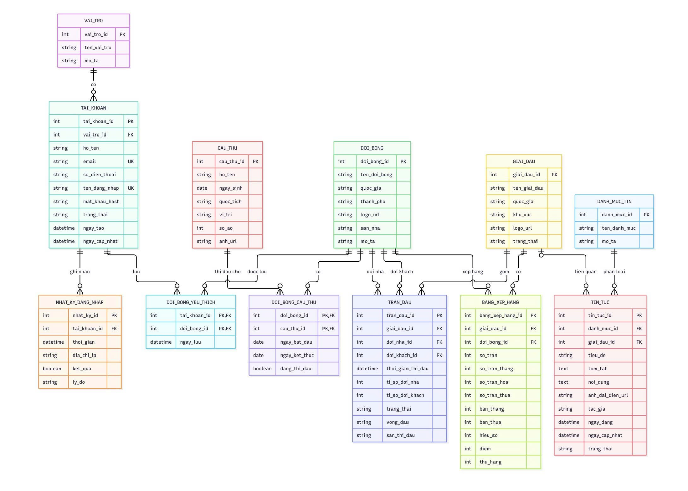

# Football Management System

Hệ thống quản lý bóng đá với các chức năng quản lý tài khoản, cầu thủ, đội bóng, giải đấu, trận đấu, bảng xếp hạng và tin tức.

## Database Design

Cơ sở dữ liệu được thiết kế theo mô hình quan hệ, trong đó các bảng được liên kết với nhau thông qua **Primary Key (PK)** và **Foreign Key (FK)**.

### ERD



## Database Tables

| STT | Bảng | Mô tả |
|---:|---|---|
| 1 | `VAI_TRO` | Quản lý các vai trò của tài khoản |
| 2 | `TAI_KHOAN` | Quản lý thông tin tài khoản và đăng nhập |
| 3 | `NHAT_KY_DANG_NHAP` | Lưu lịch sử đăng nhập của tài khoản |
| 4 | `CAU_THU` | Quản lý thông tin cầu thủ |
| 5 | `DOI_BONG` | Quản lý thông tin đội bóng |
| 6 | `DOI_BONG_YEU_THICH` | Lưu các đội bóng được tài khoản yêu thích |
| 7 | `DOI_BONG_CAU_THU` | Liên kết cầu thủ với đội bóng |
| 8 | `GIAI_DAU` | Quản lý thông tin giải đấu |
| 9 | `TRAN_DAU` | Quản lý thông tin trận đấu |
| 10 | `BANG_XEP_HANG` | Quản lý bảng xếp hạng của các đội bóng |
| 11 | `DANH_MUC_TIN` | Quản lý danh mục tin tức |
| 12 | `TIN_TUC` | Quản lý các bài viết tin tức |

## 🔗 Database Relationships

### Account

- `VAI_TRO` **1-N** `TAI_KHOAN`
- `TAI_KHOAN` **1-N** `NHAT_KY_DANG_NHAP`
- `TAI_KHOAN` **N-N** `DOI_BONG` thông qua `DOI_BONG_YEU_THICH`

### Player & Team

- `DOI_BONG` **N-N** `CAU_THU` thông qua `DOI_BONG_CAU_THU`
- `DOI_BONG` **1-N** `TRAN_DAU` với vai trò đội nhà
- `DOI_BONG` **1-N** `TRAN_DAU` với vai trò đội khách

### Tournament

- `GIAI_DAU` **1-N** `TRAN_DAU`
- `GIAI_DAU` **1-N** `BANG_XEP_HANG`
- `DOI_BONG` **1-N** `BANG_XEP_HANG`

### News

- `DANH_MUC_TIN` **1-N** `TIN_TUC`
- `GIAI_DAU` **1-N** `TIN_TUC`

## Main Entities

### `VAI_TRO`

Lưu thông tin về quyền/vai trò của người dùng.

- `vai_tro_id` — Primary Key
- `ten_vai_tro`
- `mo_ta`

### `TAI_KHOAN`

Lưu thông tin tài khoản người dùng.

- `tai_khoan_id` — Primary Key
- `vai_tro_id` — Foreign Key
- `ho_ten`
- `email` — Unique
- `so_dien_thoai`
- `ten_dang_nhap` — Unique
- `mat_khau_hash`
- `trang_thai`
- `ngay_tao`
- `ngay_cap_nhat`

### `CAU_THU`

Lưu thông tin cầu thủ.

- `cau_thu_id` — Primary Key
- `ho_ten`
- `ngay_sinh`
- `quoc_tich`
- `vi_tri`
- `so_ao`
- `anh_url`

### `DOI_BONG`

Lưu thông tin đội bóng.

- `doi_bong_id` — Primary Key
- `ten_doi_bong`
- `quoc_gia`
- `thanh_pho`
- `logo_url`
- `san_nha`
- `mo_ta`

### `GIAI_DAU`

Lưu thông tin giải đấu.

- `giai_dau_id` — Primary Key
- `ten_giai_dau`
- `quoc_gia`
- `khu_vuc`
- `logo_url`
- `trang_thai`

### `TRAN_DAU`

Lưu thông tin các trận đấu.

- `tran_dau_id` — Primary Key
- `giai_dau_id` — Foreign Key
- `doi_nha_id` — Foreign Key
- `doi_khach_id` — Foreign Key
- `thoi_gian_thi_dau`
- `ti_so_doi_nha`
- `ti_so_doi_khach`
- `trang_thai`
- `vong_dau`
- `san_thi_dau`

### `BANG_XEP_HANG`

Lưu thành tích của đội bóng trong một giải đấu.

- `bang_xep_hang_id` — Primary Key
- `giai_dau_id` — Foreign Key
- `doi_bong_id` — Foreign Key
- `so_tran`
- `so_tran_thang`
- `so_tran_hoa`
- `so_tran_thua`
- `ban_thang`
- `ban_thua`
- `hieu_so`
- `diem`
- `thu_hang`

### `TIN_TUC`

Lưu các bài viết tin tức.

- `tin_tuc_id` — Primary Key
- `danh_muc_id` — Foreign Key
- `giai_dau_id` — Foreign Key
- `tieu_de`
- `tom_tat`
- `noi_dung`
- `anh_dai_dien_url`
- `tac_gia`
- `ngay_dang`
- `ngay_cap_nhat`
- `trang_thai`

## Primary Key & Foreign Key

Các bảng sử dụng:

- **PK (Primary Key):** định danh duy nhất cho mỗi bản ghi.
- **FK (Foreign Key):** liên kết dữ liệu giữa các bảng.
- **UK (Unique Key):** đảm bảo dữ liệu không bị trùng lặp đối với các trường cần duy nhất.

Một số khóa ngoại chính:

```text
TAI_KHOAN.vai_tro_id
        ↓
VAI_TRO.vai_tro_id

NHAT_KY_DANG_NHAP.tai_khoan_id
        ↓
TAI_KHOAN.tai_khoan_id

DOI_BONG_YEU_THICH.tai_khoan_id
DOI_BONG_YEU_THICH.doi_bong_id

DOI_BONG_CAU_THU.doi_bong_id
DOI_BONG_CAU_THU.cau_thu_id

TRAN_DAU.giai_dau_id
TRAN_DAU.doi_nha_id
TRAN_DAU.doi_khach_id

BANG_XEP_HANG.giai_dau_id
BANG_XEP_HANG.doi_bong_id

TIN_TUC.danh_muc_id
TIN_TUC.giai_dau_id
```

## Junction Tables

Hai bảng được sử dụng để xử lý các quan hệ nhiều-nhiều:

### `DOI_BONG_YEU_THICH`

Liên kết:

```text
TAI_KHOAN ↔ DOI_BONG
```

Cho phép một tài khoản yêu thích nhiều đội bóng và một đội bóng được nhiều tài khoản yêu thích.

### `DOI_BONG_CAU_THU`

Liên kết:

```text
DOI_BONG ↔ CAU_THU
```

Cho phép quản lý mối quan hệ giữa đội bóng và cầu thủ.

## Database Structure

```text
Database
│
├── VAI_TRO
├── TAI_KHOAN
├── NHAT_KY_DANG_NHAP
│
├── CAU_THU
├── DOI_BONG
├── DOI_BONG_YEU_THICH
├── DOI_BONG_CAU_THU
│
├── GIAI_DAU
├── TRAN_DAU
├── BANG_XEP_HANG
│
├── DANH_MUC_TIN
└── TIN_TUC
```

## Notes

- Các bảng được đặt tên theo tiếng Việt không dấu để thuận tiện khi làm việc với cơ sở dữ liệu.
- Các quan hệ giữa bảng được thể hiện trong ERD.
- Các bảng trung gian được sử dụng cho các quan hệ nhiều-nhiều.
- Mật khẩu tài khoản được lưu dưới dạng `mat_khau_hash` thay vì lưu mật khẩu dạng plain text.

## Thành viên
***Ddawng18:*** Nguyễn Huỳnh Đăng  
***banhthinh1975-crypto:*** Bành Phát Thịnh  
***congbao2006:*** Lê Công Bảo  
***Phunguyen11-02:*** Nguyễn Lâm Sỹ Phú
